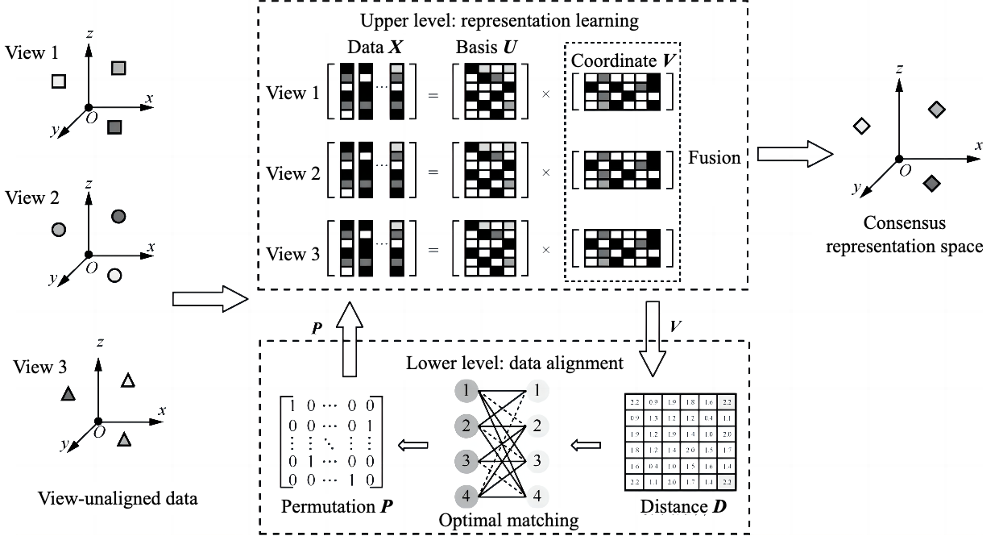

# Multiview clustering method for view-unaligned data

[中文版](README-zh.md)



## Introduction

This is the official PyTorch implementation of the paper *Multiview clustering method for view-unaligned data, Journal on Communication 2022.*

### Abstract

To address the unaligned multi-view clustering problem, an effective multi-view learning method for view-unaligned data was proposed. First, to capture cross-view latent affinity in multi-view heterogeneous feature spaces, representation learning was employed based on multi-view non-negative matrix factorization to embed original features into a measurable low-dimensional subspace. Second, view-alignment relationships were modeled as optimal matching of a bipartite graph, which could be generalized to multiple-views situations via the proposed concept reference view. Representation learning and data alignment were further integrated into a unified Bi-level optimization framework to mutually boost the two learning processes, effectively enhancing the ability to learn from view-unaligned data.


### Install & Run

```
pip install -r requirements.txt
python main.py
```

## Citation

If you find our work useful in your research, please cite us as follows:

> Ao LI, Ao Li, Cong Feng, Yutong NIU, Shibiao XU, Yingtao ZHANG, Guanglu SUN. Multiview clustering method for view-unaligned data[J]. Journal on Communications, 2022, 43(7): 143-152.