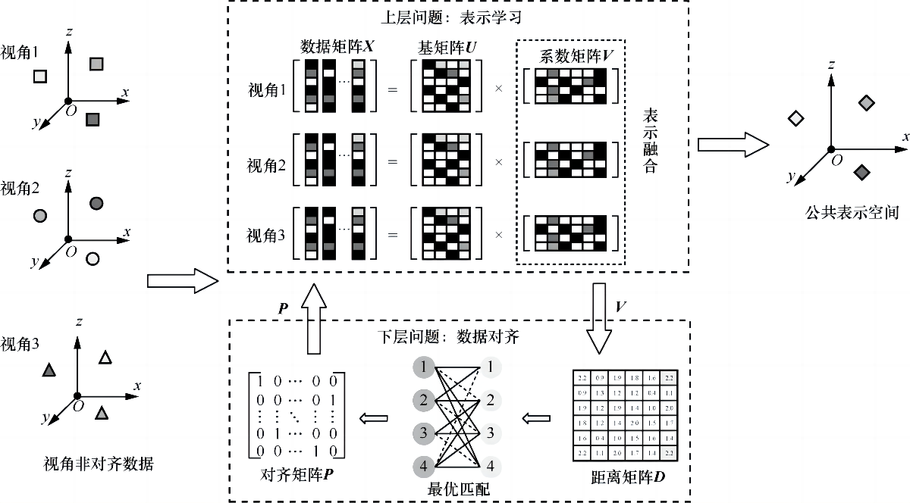

# 面向视角非对齐数据的多视角聚类方法

[English-version](README-en.md)



## 简介

这是论文《面向视角非对齐数据的多视角聚类方法》的官方 PyTorch 实现。

### 摘要

如何在视角对齐关系错位时有效进行非对齐多视角学习是一类新的挑战性问题。针对这一问题，我们提出一种面向视角非对齐数据的多视角聚类方法。一方面，为了捕获多视角异构特征的跨视角相似度信息，基于多视角非负矩阵分解进行表示学习，将原始特征嵌入一个可度量的低维同构空间。另一方面，在低维同构空间中，以二部图最优匹配模型建模视角对齐关系，并提出参考视角概念将模型推广至多视角情形。将表示学习和视角对齐关系学习整合到统一的Bi-level优化框架，使其在迭代中相互促进，进一步提高模型对视角非对齐数据的学习能力。在视角非对齐数据聚类应用上的大量实验结果表明，相比于8种先进的多视角聚类方法，所提方法在3个数据集上的多项性能指标均取得了较优的性能。

### 安装和运行

```
pip install -r requirements.txt
python main.py
```


## 引用

如果您发现我们的工作对您的研究有用，请按以下方式引用我们：

> 李骜, 冯聪, 牛宇童, 徐士彪, 张英涛, 孙广路. 面向视角非对齐数据的多视角聚类方法[J]. 通信学报, 2022, 43(7): 143-152.
