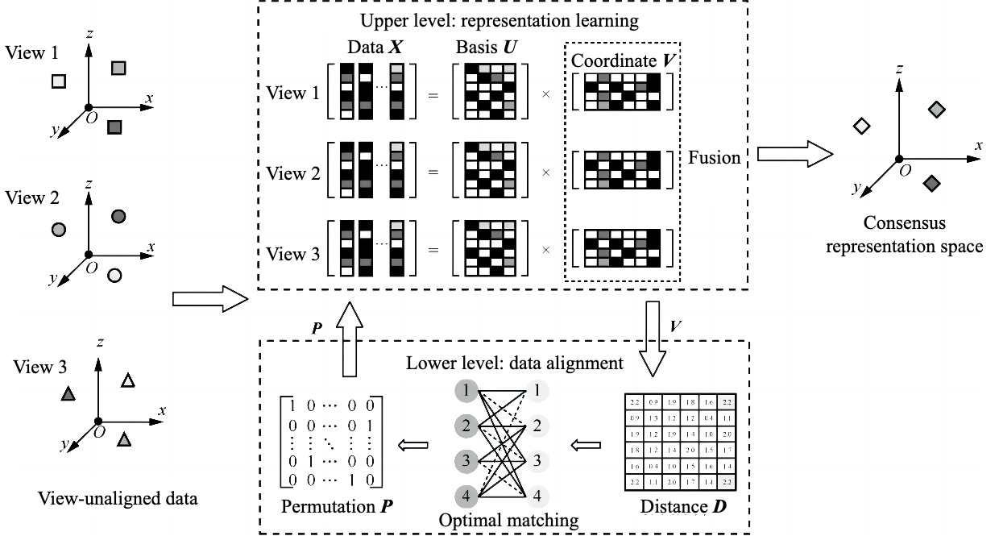

# Multiview clustering method for view-unaligned data

[中文版](README-zh.md)

## Introduction

This is the Matlab implementation of the paper *Multiview clustering method for view-unaligned data, Journal on Communication 2022.*

## Abstract

To address the unaligned multi-view clustering problem, an effective multi-view learning method for view-unaligned data was proposed. First, to capture cross-view latent affinity in multi-view heterogeneous feature spaces, representation learning was employed based on multi-view non-negative matrix factorization to embed original features into a measurable low-dimensional subspace. Second, view-alignment relationships were modeled as optimal matching of a bipartite graph, which could be generalized to multiple-views situations via the proposed concept reference view. Representation learning and data alignment were further integrated into a unified Bi-level optimization framework to mutually boost the two learning processes, effectively enhancing the ability to learn from view-unaligned data.

## Install & Run

1. System requirements: Windows 10 or higher, MATLAB 2017b or higher.
2. The dataset resides in the `dataset/` folder.
3. The command to run the demo is `src/run.m`.

## Acknowledgment

This work was inspired by the following works:

- Huang, Zhenyu, Peng Hu, Joey Tianyi Zhou, Jiancheng Lv and Xi Peng. Partially View-aligned Clustering. Neurips 2020.
- Mouxing Yang, Yunfan Li, Zhenyu Huang, Zitao Liu, Peng Hu, Xi Peng. Partially View-Aligned Representation Learning With Noise-Robust Contrastive Loss. CVPR 2021.

We used some of the code from the following work:

- G. A. Khan, J. Hu, T. Li, B. Diallo and Q. Huang, Weighted Multi-View Data Clustering via Joint Non-Negative Matrix Factorization. ISKE 2019.

## Citation

If you find our work useful in your research, please consider citing us as follows:

> Ao LI, Ao Li, Cong Feng, Yutong NIU, Shibiao XU, Yingtao ZHANG, Guanglu SUN. Multiview clustering method for view-unaligned data[J]. Journal on Communications, 2022, 43(7): 143-152.